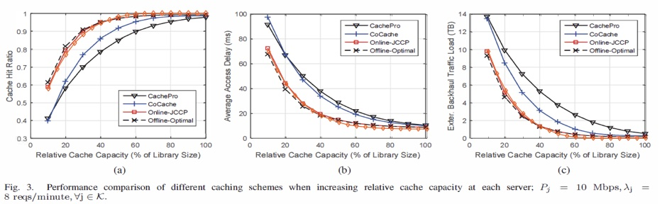
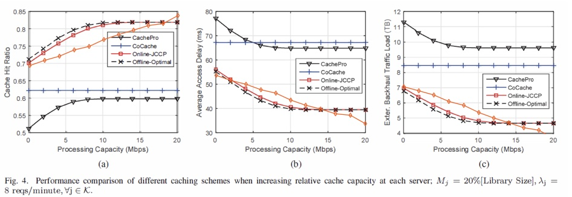

# onlineJCCP_simulation

A simulation of this work:

[Collaborative Multi-bitrate Video Caching and Processing in Mobile-Edge Computing Networks](https://arxiv.org/abs/1612.01436)

which proposed a vedio caching algorithm called online JCCP trying to minimizes the backhaul network cost, subject to the cache storage and processing capacity constraints in MEC network.

## Simulation Results

In the original work, the cache hit ratio, average access delay and external backhaul traffic load under proposed algorithm is compared with CachePro, CoCache algorithm and the Offline Optimal solution.

The orange line below represent our simulation results of the proposed algorithm.

